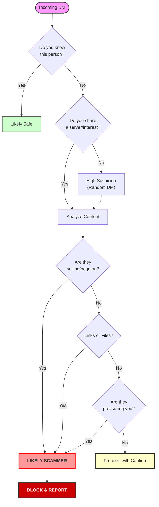

# Scamming-101
This will be a megathread on all of the scams that I have personally encountered, and how to identify scams by platform.

> *Author: AsterNullbyte, 2026*

---

## Opening
Hi everybody! I'm AsterNullbyte, woof! If you are not coming to this page from either my cardd, my twitter, or one of my other socials, allow me to introduce myself! 

I'm a Puppyboy Virus VTuber, with a background in cybersecurity! I have worked in a professional setting doing multiple roles including as a security researcher at one point, and I do my best to try and educate everybody on digital security and keeping themselves safe in the big 26! You can find me cross-streaming on twitch and youtube, and find me posting whatever's on my mind on my (18+) twitter!

In this megathread, I'll be going over all different types of scams, how to identify scams on your own, and what the most common scams are on each platform (by my own research or experience!). If you have any questions, or want to add on suggestions then please raise an issue or make a pull request! Thank you for helping to keep the internet safe for everybody :D

If you want to go to a specific section, in the *TOP RIGHT CORNER* there is a list icon, that would be the table of contents for you to easily circumnavigate. This is a WORK IN PROGRESS, some things may not be completely filled out yet.

---

## Discord

### DM scams - Best practices
99% of scams take place via DM's (Direct Messages) due to the fact they're 1-on-1 communication, and server moderators can't take preventative action. Here are the BEST pratices to catch it very quickly.

1. **You should TURN ON `Message Filtering`.**
   

     
   

Go to `Content & Social` (1) and then ``Direct Message spam`` (2), setting it to `Filter from non-friends`. You can set it to everybody if you wish, but this is working off of the assumption that you only add people on discord you trust.

2. **You should scroll down to `Social Permissions` and ENABLE `Message Requests`.**
   

     
   

> [!NOTE]
> Discord generally does a good job filtering scammers/spammers/etc with this feature, but it is not 100% accurate and depends on multiple factors that are not public knowledge. Do not rely on message filters as the "end all".

   If you turn off direct messages from people you share a server with, this feature will be disabled. There is no inbetween.

3. **Limit your friend requests**
   

     
   

   I have my friend requests on my personal account set to everybody because I can filter out who I want to talk to and who's going to waste my time, but if you're on discord only for a small and specific friendgroup then I suggest setting this to friends of friends only. This will generally work very well, with the only caveat being that you would have to manually add everybody you wanted to talk to if they weren't a friend of somebody you already have on your friends list.

---

### DM Scams - Identifying

Obviously, this list will not contain every scam run by people until the end of time, it will be your responsibility to use common sense to determine for yourself if the person you are talking to is a scammer, I am just providing you the resources to make an educated decision.

#### Initial Contact
Most scam attempts work off of some sort of pregenerated script, The person(s) who made the actual script is smart enough to realise that 90% of the time their scam won't work and they'll be wasting their time so they sell it to any idiot on a black market site and money to spare to perpetuate their scams. Most of the time, these are either children or people from 3rd world countries trying to flip expensive accounts as it pays more than getting an actual job. 

This helps us though! *Most* scammers will speak very poor english outside of their script, or their responses will seem robotic (e.g. You ask them a question and they continue yapping about whatever they're trying to get you to do). What you're looking for on initial contact are getting filtered message requests from people who've never talked in that specific server, or to you directly before, and if you give them even a tiny bit of attention they'll quickly start throwing up red flags.

Here's an example of that in action.

  

> [!NOTE]
> (Disregard "No servers in common" as they were banned before I took this screenshot. They were in a server I really only lurk in for self-hosting related issues/questions.)

This user is a clearly compromised account. They have discord nitro but this does not matter here, do not trust just because somebody has nitro that they are legitimate. They also had no activity in the server, and randomly sent me a dm out of all people. They were not a moderator nor had a reason to reach out to me, which 9/10 is what scammers do by targeting people with discord nitro (like I do, sue me I like using cute emojis) or accounts that seem valuable. 

When I give 'her' attention, you can see that this person replies in broken english (I know some european/RU users also speak like this, but given our above assessment this only raises their suspicion level.) and while I won't give the full conversation (my twitter post mocking them can be found [here](https://x.com/AsterNullbyte/status/2021204183995544062)) they claimed to be a starving artist looking for feedback on "their" art, which was likely created by Charles G. ParagraphTyper the 5th. (I'll give you a cookie if you figure out what service I'm talking about lol) and while I do generally like messing with scammers, I was pressed for time so I simply had them banned from the offending server and went about my day. 

What likely was going to happen was they were going to try and get me to click on a website which would have either scraped my IP, my discord cookie, or gave me a link to a fake discord which I would have had to sign in 'again'.

> [!CAUTION]
> **BLOCK AND REPORT THESE PEOPLE. DO NOT FOLLOW THEIR INSTRUCTIONS. REPORT THEM TO MUTUAL SERVERS.**
>
> ***DO NOT OPEN ANY LINKS OR FILES THEY MAY GIVE YOU.***

You can report them easily by using the `Report Spam` button in the top menu. If they get enough reports, discord will manually review them before banning them! (I have seen it done myself)

### Scammer behavior
Scammers rely on using your human emotions to take over and make stupid decisions. You have a monkey brain, we all do. It's hard wired to be naturally empathetic to other people, and as such people take advantage of that.
Your best tool to avoiding falling victim is remembering the following, and is a good rule of thumb for any interaction:

1. **Do you know this person?** If you're randomly getting approached by somebody you've never talked to before, and you have no reason to be talking to them (e.g. you're doing commissions) then remain cautious to what they want from you.
   
   1.1 **The "Trojan Horse" Friend** Just because a message comes from a friend you've known for 5 years does not mean it is safe. If your bestie suddenly starts talking like a robot, asks you to "test their new game," or sends you a QR code, their account is likely compromised. Do not assume people around you are 100% well intentioned all the time and use common sense.

2. **Are they trying to sell you something?** In conjunction with 1, if you weren't intent on buying something from them and they try and offer it out of the blue then you should take a step back and reassess the situation.
3. **Are they trying to pressure you?** Most scammers will attempt to convince you to ACT NOW, THINK LATER. This is exactly what they want you to do, because if you take a step back and take a minute or two to analyze the situation then you would likely not carry through with their requests, so they try and get you in the mindset you have to act immediately or else.
4. **Are they trying to get you to click on a link or open a file?** Do not put human trust into this factor, is the link they are sending you known? Is it appropriate for what they want? (e.g. sending you a link to "ro.blox" instead of "roblox.com") If they are sending you a file that you did not explicitly ask for (Like buying commissioned assets) do **NOT** download it and report it.

List of scams I have personally been sent

I have seen the following used as scams in my time:

*   **Starving artist looking for work**
    

      
    

*   "Vote for my server" on random website
*   "My team is short a player"
*   Crypto (Generally only based in crypto related servers)
*   Free nitro offers
*   Free robux
*   Free roblox exploits (I swear to you, I'm not making that shit up)
*   "I reported your discord/steam account on accident"
*   Fake discord/steam support
*   "I made a game, can you test it?"
     
 
        They will send you a .zip or .exe file. It is not a game. It is a 'stealer' (InfoStealer) that grabs your browser cookies and Discord token, allowing them to bypass your password and 2FA.
        

Inside is a flow chart that is very easy to break down and understand with the information that's been given so far.

   

---

### Server scams - Best practices
My advice would remain relatively the same here as above on most accounts, with some caveats here.
1. Don't join random servers, especially if random accounts are sending you the invite in dms or posting them in a server you're in.
2. While Discord's built-in "Server Discovery" is generally safe, third-party sites are filled with "Free Nitro" or "NSFW" bait servers. If a server description promises you money or free products just for joining, it is a lie.

Absolutely do not verify with any bots that you do not trust. People will also make FAKE bots of well known ones such as dyno, always confirm it's the legitimate version of the bot.

List of safe to use bots

The following are safe, and have zero interest in stealing your account(s).

*   **Dyno**
*   **Sapphire**
*   **Mee6** (Although I have my own personal biases with this shit company, they aren't actively malicious to anybody's current knowledge)
*   **Wick** (This bot is absolutely prone to getting copycats made of it, be extra vigilant)

  -- For roblox verification bots
*    **RoVer**
*    **Bloxlink**
*    **RoWifi** (Their bot is slow as shit and they had an exposed pedophile as the head of customer support, I don't recommend it)

---
### Server Scams - Identifying

1. **The Verification Trap**
   This is the most common way servers steal accounts. You join a server, and a bot (or a channel) tells you that you must "Verify" to see the rest of the channels.

   These servers are not real; you will never be verified. If you open this link, it will take you to a website asking you to scan a QR code or to a fake Discord login page. When you type in your password or scan the QR code, you'll be immediately logged out of your account.

> [!TIP]
> You should ONLY trust bots that have a **"Verified App"** badge.
   
   
   
   This is the legitimate Bloxlink application. Notice the checkmark that says "APP". 
   
   
   
   This is my server's bot. It is missing the checkmark because I have not verified it. Do not trust unverified applications that ask for sensitive data.

   > [!IMPORTANT]
   > **Legitimate bots will NEVER ask for your password or your account token.**
   > Discord will automatically display a popup if a legitimate application is asking to link to your account. It will never happen inside a random website browser window.

2. **The "Compromised Webhook"**
   Sometimes, a perfectly safe server you've been in for months will suddenly ping @everyone with a message like:
   *   "WE ARE MINTING A NEW NFT!"
   *   "OWNER IS LEAVING, FREE NITRO FOR EVERYONE"

   If a server that usually talks about Minecraft suddenly starts talking about Crypto/NFTs with urgent "Claim Now" links, the server (or a moderator's webhook) has been hacked. Do not click the link. Leave the server or wait for the actual admins to fix it.

3. **The "Leak" / Illegal Content Server**
   Servers promising "OnlyFans Leaks," "Paid Scripts for Free," or "Nudity" are often honeypots. They exist to get you to download malware.
   
---

### Common errors
A lot of people are unaware of these things, or do not think about them until after they've been scammed and are informed of it. Here are some important things you NEED to know.

-- Common
1. **Check the links you are sent.**
   
   Compare the two links; `https://ro.blox.com` and `https://roblox.com`. Do you see the difference here? Scammers rely on previously mentioned pressure tactics so that you don't check what you're actually clicking on.
2. **DO NOT SCAN DISCORD QR CODES.**

   The Discord mobile app QR scanner is strictly for logging in. If you scan a code sent by a stranger, you are bypassing your own password and 2FA to log them into your account instantly.
3. **Check the Embeds/Hyperlinks.**

   Scammers can use markdown to hide links. For example, `[Click Here](https://evil.site)`. Always hover over a link before clicking to see the true destination in the bottom left of your browser/client.

-- Staff impersonation
1. **Discord will not send you DM's on their personal account(s).** This applies to every platform, but we're talking about discord here.

   If there is an issue with your account, they will send you a message via their actual notification system which you CAN'T reply to. Any other method on discord is illegitimate.

   Discord employees will NOT tell you that if you don't do X you will get banned, you'll simply get a "fuck you" notice and you magically can't send people DM's for 3 days (Ask me how I know, and what discord's response was for my appeal of the message "fuck you (name of ex)" was)

2. **Discord will actively prevent you from sending your own token.**

   Discord recognizes that some people aren't aware what your token really does, and actively warns you before you send it! This is super helpful if people are trying to get you to send them the contents of an inspect element tool (which you shouldn't be doing anyway), or some other method. Do NOT send these people your token, obviously.

3. **Discord employees will have badges on discord that signify themselves as employees**

   Using Tracie as the example here, since she seems to be a product manager or at the very least runs the Discord Town Hall. She is an official staff member, as she had the tool icon on her profile. If you were to hover your mouse over it, it would appear with `Discord staff` and if you clicked on it, it would take you to their website. Anybody else claiming to be a staff member, or a staff member "using a personal account" is for lack of a better word full of shit.

4. **External "Support" Agents do not exist.**

   Discord, Steam, and Riot Games do not have "Admins" that will DM you on Discord to resolve a ban or a report. If someone tells you to add `Valve_Admin_Mike#1234` to save your account, you are being scammed. Block them immediately.

---

### HELP! I got hacked!

If you think you messed up, do not panic, but act FAST:
1. Change your password immediately. This forces a logout on all devices, it will ALSO invalidate any tokens or cookies associated with your account (bot tokens do not count)
2. Run an Antivirus scan (Malwarebytes is a good free option, but windows defender also works at a similar accuracy) if you downloaded a file.
3. Check your Authorized Apps. Go to User Settings > Authorized Apps and de-authorize anything you don't recognize.

If you are locked out of your account, use "Forgot my password". Discord implemented a feature where you can't change your email without confirming with your current email that you wish to change emails, this ensures that even if you are locked out of your account that you can regain access by simply requesting a password reset.

   

